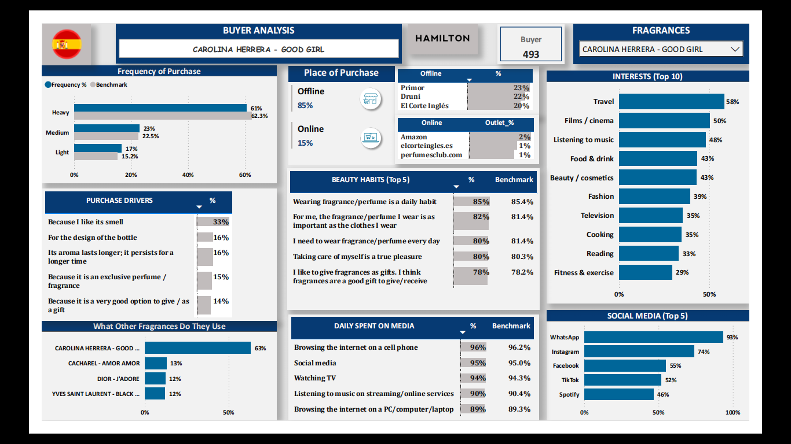

# Consumer Fragrance Insights : A Power BI Report

An interactive **Power BI dashboard** that provides deep insights into consumer behavior across **154 fragrances**, highlighting differences between users, buyers, and gifters.  

---

## 📂 Project Overview  

This project transforms raw survey data into a **visual analytics tool** for fragrance market research.  
It allows stakeholders to explore consumer demographics, shopping missions, and benchmark comparisons with just a few clicks.  

---

## ⚙️ Data Source & Preparation  

- **Raw Data**: Survey responses in SPSS format (`.sav`)  
- **Processing**:  
  - Converted to Excel using **R scripts** for integration with Power BI  
  - Reshaped from **wide → long format** for users, buyers, and gifters  
  - Enriched with **demographic** (age, gender, income) and **behavioral** (shopping mission) dimensions  

---

## 🛠 Tools Used  

- **R** → Data conversion from `.sav` to `.xlsx`
- **Excel** → Data Cleaning and filtering to add only relevant data. 
- **Power BI** → Data modeling (**DAX**), transformation (**Power Query**), and Visualization.

---

## 🔑 Key Features  

- **🔎 Fragrance Selection Filter** → Dynamically updates all visuals (user, buyer, gifter)  
- **👥 Demographics Breakdown** → Gender split, age groups, income levels  
- **🛒 Shopping Mission Analysis** → Gifting, replenishment, trial, behalf, with benchmarks  
- **📊 Benchmark Comparisons** → Side-by-side bar charts for % vs benchmark  
- **🖼 Fragrance Image Display** → Auto-updates based on selected fragrance  
- **📌 KPI Cards** → Total respondents + user, buyer, and gifter counts  

---

## 🚀 Impact  

- Enabled **one-click view** of consumer profiles for 154 fragrances  
- Simplified **comparison of user vs buyer vs gifter behavior**  
- Identified **region-specific underperformance of newly launched fragrances**, highlighting gaps in customer reviews and pricing competitiveness.
- Enabled data-backed evaluation of launch effectiveness by **comparing new fragrances against established competitors** across regions.
- Provided actionable insights to inform pricing strategy, review acquisition focus, and regional marketing prioritization.

---

## 📸 Dashboard Preview  

---

